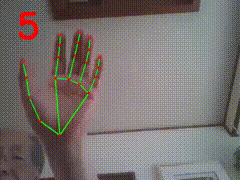

# air_calculator

# How to run fingermath.py

fingermath.py is a program for drawing a formula, for example, 4-5.
Drawing the formula by using a single finger. Move a pen by two fingers.
Four fingers can save the formula for calculating it. 
The result will be shown on the screen.

"L" represents "1".

"S" or "5" represents "5".

"P" represents "+" operator.

"W" or "-" represents "-" operator.

"V" represents "/" division operator.

"M" represents "*" multiplication operator.

"&" represents "\**" exponential operator.

"a" and "A" represent sqrt() function. a13A represents sqrt(13).

$ python fingermath.py

<pre>         1-3=?                                 10+2=?  </pre>
 

<pre>        4-5-3=?                                2-3/5=?   </pre>
 

<pre>        34*5=?                         2**8=?</pre>
   

<pre> 128v3=? -> 128/3=?                    a11AV3=? -> sqrt(11)/3 </pre>            
 

