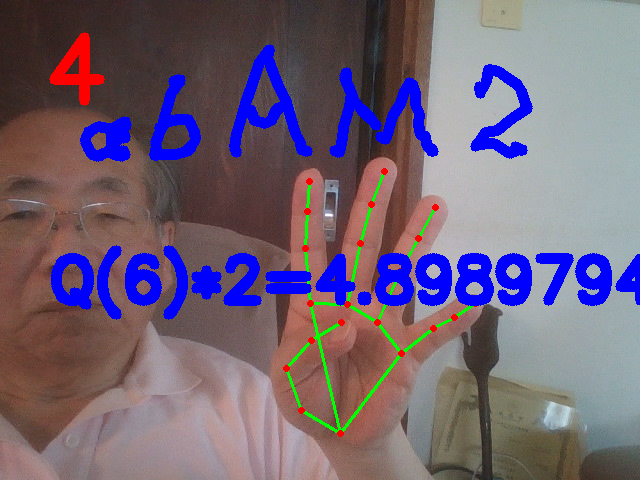

# air_calculator

Writing letters with a pen on paper is very different from drawing letters in the air.

Drawing "-" minus operator and "+" operator in the air are extremely difficult so that these operators are replaced by "W" and "P" respectively.

For example, the number one "1" is replaced by "L" when drawing letters by fingers in air.

# How to run fingermath.py

fingermath.py is a program for drawing an expression, for example, 4-5.

fingermath.py is based on mediapipe.

There are six states of five fingers recognized by mediapipe library: 
0-finger, 1-finger, 2-finger, 3-finger, 4-finger, and 5-finger respectively.
<pre>
A pen of index finger tip is used for drawing an expression by fingers. 

0-finger can move the pen without drawing. 
1-finger can draw lines in the air. 
2-finger can move the pen without drawing. 
3-finger can delete elements of drawn letters for expression correction.
4-finger can transform hand-written letters to the digital text for possible calculation.
5-finger can can move the pen without drawing. 
</pre>

Continuous 4-finger state can terminate and exit this program.

0-finger or 5-finger is equivalent to 2-finger.

The saved picture is tranformed into digital text using the state-of-the-art 
optical character recognition.

Writing letters with a pen on paper is very different from drawing letters in the air.

From 0 to 9 digit number, 1 is the most difficult to be recognized.

"L" in the air represents "1".

"S" or "5" in the air represents "5".

"P" in the air represents "+" plus operator.

"W" or "-" represents "-" minus operator.

"V" in the air represents "/" division operator.

"M" in the air represents "*" multiplication operator.

"&" in the air represents "\**" exponential operator.

"a" and "A" in the air represent sqrt() function. a13A represents sqrt(13).

$ python fingermath.py

https://youtu.be/med_jrFTMPA
<pre>  sqrt(6)*2=?    </pre>

<pre>         1-3=?                                 10+2=?  </pre>
 

<pre>        4-5-3=?                                2-3/5=?   </pre>
 

<pre>        34*5=?                         2**8=?</pre>
   

<pre> 128v3=? -> 128/3=?                    a11AV3=? -> sqrt(11)/3 </pre>            
 

